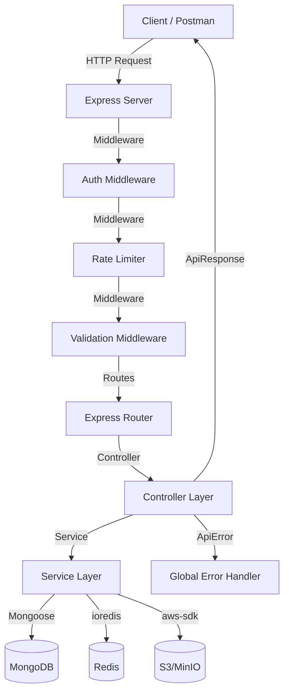

# Architecture Documentation

## Overview
This API follows a **Layered Architecture** (Clean Architecture inspired) to ensure separation of concerns, scalability, and testability.

## Flow Diagram

## Layers
1.  **Config**: Handles environment variables, DB connections, and third-party client initialization.
2.  **Controllers**: Request handling layer. Extracts data from requests and calls services.
3.  **Services**: Business logic layer. Independent of the transport layer (Express).
4.  **Models**: Mongoose schemas and database-specific logic.
5.  **Middlewares**: Shared logic like Auth, Error Handling, and Validation.
6.  **Utils**: Shared helper functions (Logger, ApiError, catchAsync).

## Tech Stack
- **Web Framework**: Express.js (Node.js 20+)
- **Database**: MongoDB (Mongoose)
- **Caching**: Redis (Token storage, Rate limiting)
- **Validation**: Zod
- **Documentation**: Swagger / OpenAPI
- **Logging**: Pino
- **Testing**: Jest / Supertest
